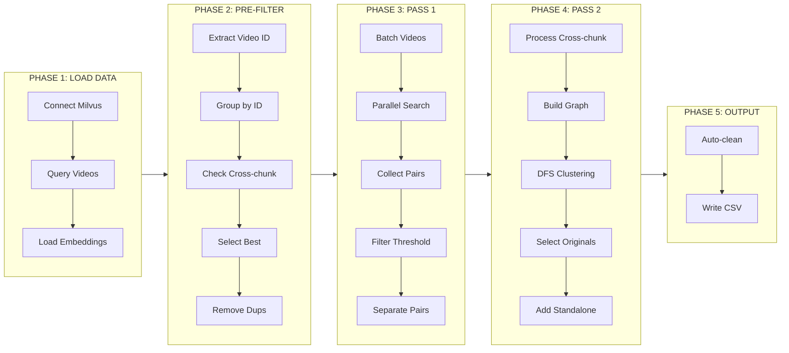
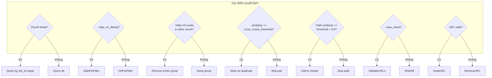
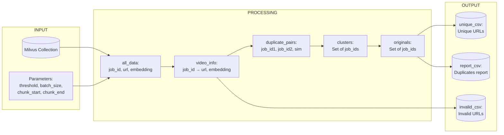
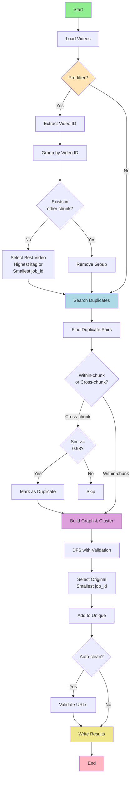

# FLOWCHART: Luồng Lọc Trùng - search_duplicates_aggregated.py

## Mermaid Flowchart

```mermaid
flowchart TD
    Start([Bắt đầu]) --> Connect[Kết nối Milvus<br/>Load Collection]
    
    Connect --> CheckChunk{Chunk Mode?}
    
    CheckChunk -->|Có| QueryChunk[Query theo job_id range<br/>url_XXXX format]
    CheckChunk -->|Không| QueryAll[Query tất cả videos]
    
    QueryChunk --> LoadData[Load embeddings + URLs<br/>all_data = job_id, url, embedding]
    QueryAll --> LoadData
    
    LoadData --> BuildVideoInfo[Xây dựng video_info map<br/>job_id → url, embedding]
    
    BuildVideoInfo --> CheckSkipURL{--skip_url_dedup?}
    
    CheckSkipURL -->|Có| SkipPreFilter[Bỏ qua Pre-filtering<br/>Giữ tất cả videos]
    CheckSkipURL -->|Không| PreFilter[PRE-FILTERING]
    
    PreFilter --> ExtractVideoID[Extract Video ID từ URL<br/>Google CDN: gcdn_id_XXX<br/>YouTube: youtube_XXX]
    
    ExtractVideoID --> GroupByID[Nhóm videos theo Video ID<br/>video_id_groups]
    
    GroupByID --> CheckChunkMode{Chunk Mode?}
    
    CheckChunkMode -->|Có| CrossChunkCheck[Kiểm tra Video ID<br/>trong chunks khác]
    CheckChunkMode -->|Không| SelectBest[Chọn video tốt nhất<br/>trong mỗi group]
    
    CrossChunkCheck --> RemoveCrossChunk[Loại bỏ groups<br/>đã tồn tại ở chunk khác]
    RemoveCrossChunk --> SelectBest
    
    SelectBest --> SelectByItag[Ưu tiên: itag cao nhất<br/>Nếu không: job_id nhỏ nhất]
    
    SelectByItag --> RemoveDupURL[Xóa URL duplicates<br/>Giữ 1 video/group]
    
    RemoveDupURL --> Pass1
    SkipPreFilter --> Pass1[PASS 1: Tìm Duplicate Pairs]
    
    Pass1 --> BatchVideos[Chia videos thành batches<br/>batch_size = 10 max]
    
    BatchVideos --> ParallelSearch[Parallel Search với threads<br/>Search trên Milvus]
    
    ParallelSearch --> CollectPairs[Thu thập duplicate pairs<br/>job_id1, job_id2, similarity]
    
    CollectPairs --> FilterThreshold[Lọc pairs:<br/>similarity >= threshold]
    
    FilterThreshold --> NormalizePairs[Normalize pairs<br/>Sort job_ids để tránh trùng]
    
    NormalizePairs --> SeparatePairs[Tách pairs:<br/>- within-chunk<br/>- cross-chunk]
    
    SeparatePairs --> Pass2[PASS 2: Clustering & Chọn Originals]
    
    Pass2 --> ProcessCrossChunk[Xử lý Cross-chunk Duplicates]
    
    ProcessCrossChunk --> CheckCrossThreshold{similarity >=<br/>cross_chunk_threshold?}
    
    CheckCrossThreshold -->|Có| MarkCrossDup[Đánh dấu duplicate<br/>nếu original ở chunk khác]
    CheckCrossThreshold -->|Không| SkipCrossDup[Bỏ qua pair này]
    
    MarkCrossDup --> BuildGraph
    SkipCrossDup --> BuildGraph[Xây dựng Graph<br/>job_id → neighbors]
    
    BuildGraph --> BuildSimilarityDict[Xây dựng similarity lookup<br/>job_id1, job_id2 → similarity]
    
    BuildSimilarityDict --> DFS[DFS với Path Validation<br/>Max path length = 3<br/>Path similarity >= threshold × 0.9]
    
    DFS --> FindClusters[Tìm Connected Components<br/>Mỗi cluster = 1 nhóm duplicates]
    
    FindClusters --> ProcessClusters[Xử lý từng Cluster]
    
    ProcessClusters --> SortByJobID[Sort job_ids theo số<br/>job_id nhỏ nhất = original]
    
    SortByJobID --> SelectOriginal[Chọn original<br/>Thêm vào unique_videos]
    
    SelectOriginal --> AddDuplicates[Thêm duplicates vào<br/>duplicates list]
    
    AddDuplicates --> CheckStandalone{Còn videos<br/>standalone?}
    
    CheckStandalone -->|Có| AddStandalone[Thêm standalone videos<br/>vào unique_videos]
    CheckStandalone -->|Không| AddCrossDup
    
    AddStandalone --> AddCrossDup[Thêm cross-chunk duplicates<br/>vào duplicates list]
    
    AddCrossDup --> CheckAutoClean{--auto_clean?}
    
    CheckAutoClean -->|Có| ValidateURL[Kiểm tra URL hợp lệ<br/>Loại bỏ PNG/images<br/>Loại bỏ URLs lỗi]
    CheckAutoClean -->|Không| WriteResults
    
    ValidateURL --> SeparateValid[Tách valid/invalid URLs]
    SeparateValid --> WriteResults[Ghi kết quả]
    
    WriteResults --> WriteUnique[Ghi unique_csv<br/>Danh sách URLs unique]
    WriteUnique --> WriteReport[Ghi report_csv<br/>Duplicates với original mapping]
    
    WriteReport --> CheckInvalid{Invalid URLs?}
    
    CheckInvalid -->|Có| WriteInvalid[Ghi invalid_csv<br/>Invalid URLs report]
    CheckInvalid -->|Không| End
    
    WriteInvalid --> End([Kết thúc])
    
    style Start fill:#90EE90
    style End fill:#FFB6C1
    style PreFilter fill:#FFE4B5
    style Pass1 fill:#ADD8E6
    style Pass2 fill:#DDA0DD
    style WriteResults fill:#F0E68C
```

## Flowchart Chi Tiết - Các Bước Quan Trọng

## Decision Points Chi Tiết

## Data Flow

## Critical Logic Flow

