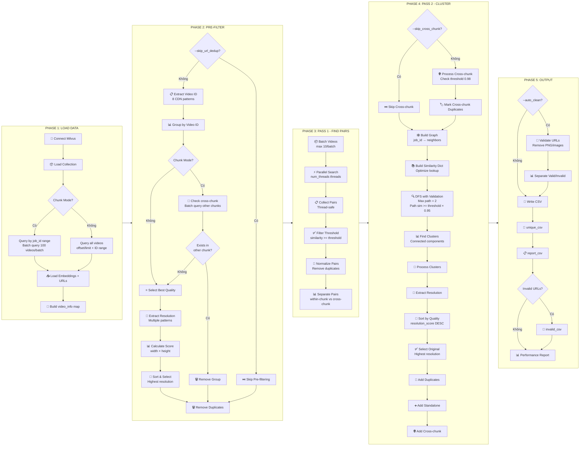
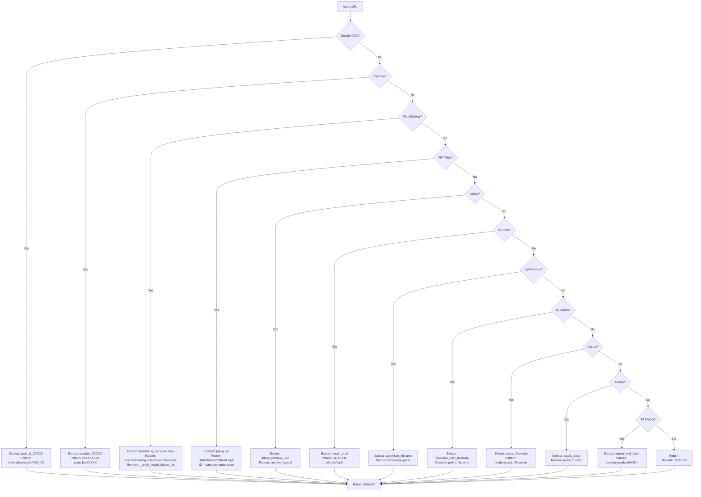
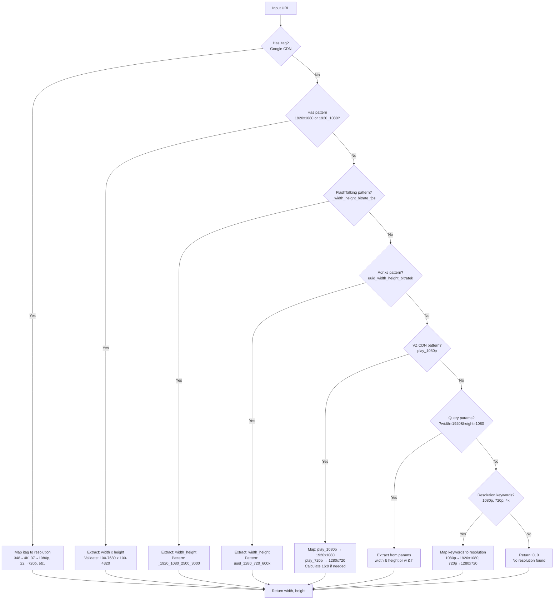
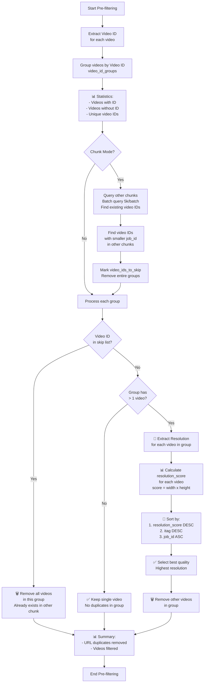
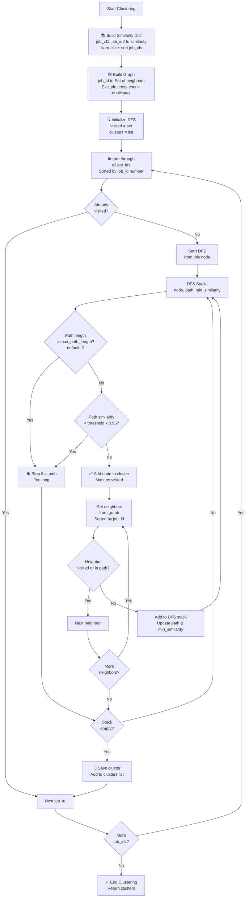
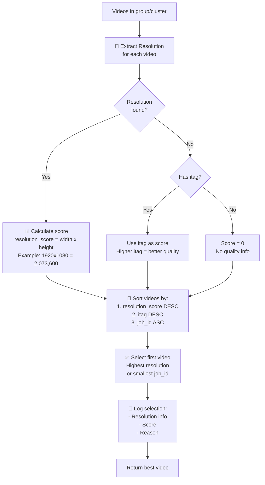

# FLOWCHART: Luồng Lọc Trùng - search_duplicates_aggregated.py

## ✨ CẬP NHẬT MỚI (2025)

### Các Cải Tiến Chính:
- ✅ **Video ID Extraction**: Hỗ trợ 8 CDN mới (FlashTalking, FPT Play, Adnxs, VZ CDN, UpPremium, BlueAdss, Adsrvr, AIActiv)
- ✅ **Resolution Extraction**: Hỗ trợ nhiều patterns mới (FlashTalking, Adnxs, VZ CDN, query params)
- ✅ **Best Quality Selection**: Dùng `resolution_score` (width × height) thay vì chỉ itag
- ✅ **Cross-chunk Detection**: Phát hiện duplicates giữa các chunks với threshold riêng
- ✅ **Path Validation**: DFS với validation để tránh transitive closure

---

## Mermaid Flowchart - Tổng Quan

```mermaid
flowchart TD
    Start([Bắt đầu]) --> Connect[🔌 Kết nối Milvus<br/>Load Collection]
    
    Connect --> CheckChunk{📦 Chunk Mode?}
    
    CheckChunk -->|Có| QueryChunk[Query theo job_id range<br/>url_XXXX format<br/>Batch query để tránh message size limit]
    CheckChunk -->|Không| QueryAll[Query tất cả videos<br/>Sử dụng offset/limit + ID range]
    
    QueryChunk --> LoadData[📥 Load embeddings + URLs<br/>all_data = job_id, url, embedding]
    QueryAll --> LoadData
    
    LoadData --> BuildVideoInfo["🔧 Xây dựng video_info map<br/>job_id to url, embedding"]
    
    BuildVideoInfo --> CheckSkipURL{"--skip_url_dedup?"}
    
    CheckSkipURL -->|Có| SkipPreFilter[⏭️ Bỏ qua Pre-filtering<br/>Giữ tất cả videos]
    CheckSkipURL -->|Không| PreFilter[🔍 PRE-FILTERING]
    
    PreFilter --> ExtractVideoID[📋 Extract Video ID từ URL<br/>✨ 8 CDN được hỗ trợ:<br/>- Google CDN, YouTube<br/>- FlashTalking, FPT Play<br/>- Adnxs, VZ CDN<br/>- UpPremium, BlueAdss<br/>- Adsrvr, AIActiv]
    
    ExtractVideoID --> GroupByID["📊 Nhóm videos theo Video ID<br/>video_id_groups: video_id to list of job_ids"]
    
    GroupByID --> CheckChunkMode{Chunk Mode?}
    
    CheckChunkMode -->|Có| CrossChunkCheck[🔗 Kiểm tra Video ID<br/>trong chunks khác<br/>Batch query để tối ưu]
    CheckChunkMode -->|Không| SelectBest[⭐ Chọn video tốt nhất<br/>trong mỗi group]
    
    CrossChunkCheck --> CheckExist{Video ID exists<br/>in other chunk<br/>with smaller job_id?}
    
    CheckExist -->|Có| RemoveCrossChunk[🗑️ Loại bỏ toàn bộ group<br/>Đã tồn tại ở chunk khác]
    CheckExist -->|Không| SelectBest
    
    RemoveCrossChunk --> Pass1
    
    SelectBest --> ExtractResolution[📐 Extract Resolution từ URL<br/>✨ Hỗ trợ nhiều patterns:<br/>- FlashTalking: _width_height_bitrate_fps<br/>- Adnxs: _width_height_bitratek<br/>- VZ CDN: play_1080p<br/>- Query params: ?width=1920&height=1080]
    
    ExtractResolution --> CalculateScore["📊 Tính resolution_score<br/>score = width x height<br/>Hoặc itag nếu không có resolution"]
    
    CalculateScore --> SortByQuality["🔢 Sort videos:<br/>1. resolution_score DESC<br/>2. itag DESC<br/>3. job_id ASC"]
    
    SortByQuality --> SelectBestQuality[✅ Chọn video có resolution cao nhất<br/>Giữ lại trong group]
    
    SelectBestQuality --> RemoveDupURL[🗑️ Xóa URL duplicates<br/>Giữ 1 video/group<br/>Loại bỏ các video còn lại]
    
    RemoveDupURL --> Pass1
    SkipPreFilter --> Pass1[🔍 PASS 1: Tìm Duplicate Pairs]
    
    Pass1 --> BatchVideos[📦 Chia videos thành batches<br/>batch_size = 10 max<br/>Zilliz limit]
    
    BatchVideos --> ParallelSearch[⚡ Parallel Search với threads<br/>num_threads threads<br/>Search trên Milvus/Zilliz]
    
    ParallelSearch --> CollectPairs[📋 Thu thập duplicate pairs<br/>job_id1, job_id2, similarity<br/>Thread-safe collection]
    
    CollectPairs --> FilterThreshold["✅ Lọc pairs:<br/>similarity >= threshold<br/>Validate score: 0.0 to 1.0"]
    
    FilterThreshold --> NormalizePairs["🔄 Normalize pairs<br/>Sort job_ids để tránh trùng<br/>Remove duplicate pairs"]
    
    NormalizePairs --> SeparatePairs["📊 Tách pairs:<br/>- within-chunk pairs<br/>- cross-chunk pairs"]
    
    SeparatePairs --> Pass2[🔗 PASS 2: Clustering & Chọn Originals]
    
    Pass2 --> ProcessCrossChunk[🌐 Xử lý Cross-chunk Duplicates]
    
    ProcessCrossChunk --> CheckCrossThreshold{"similarity >=<br/>cross_chunk_threshold?<br/>default: 0.98"}
    
    CheckCrossThreshold -->|Có| CheckOriginal{"Original ở<br/>chunk khác?"}
    CheckCrossThreshold -->|Không| SkipCrossDup[⏭️ Bỏ qua pair này<br/>Similarity quá thấp]
    
    CheckOriginal -->|Có| MarkCrossDup[🏷️ Đánh dấu duplicate<br/>nếu original ở chunk khác<br/>Thêm vào cross_chunk_duplicates]
    CheckOriginal -->|Không| SkipCrossDup
    
    MarkCrossDup --> BuildGraph
    SkipCrossDup --> BuildGraph["🕸️ Xây dựng Graph<br/>job_id to neighbors<br/>Chỉ within-chunk pairs"]
    
    BuildGraph --> BuildSimilarityDict["📚 Xây dựng similarity lookup<br/>job_id1, job_id2 to similarity<br/>Dict để tối ưu lookup"]
    
    BuildSimilarityDict --> DFS["🔍 DFS với Path Validation<br/>Max path length = 2<br/>Path similarity >= threshold x 0.95<br/>Tránh transitive closure"]
    
    DFS --> FindClusters["📊 Tìm Connected Components<br/>Mỗi cluster = 1 nhóm duplicates<br/>Iterative DFS để tránh recursion limit"]
    
    FindClusters --> ProcessClusters[🔄 Xử lý từng Cluster]
    
    ProcessClusters --> ExtractResCluster[📐 Extract Resolution cho mỗi video<br/>trong cluster]
    
    ExtractResCluster --> SortByQualityCluster[🔢 Sort videos trong cluster:<br/>1. resolution_score DESC<br/>2. job_id ASC]
    
    SortByQualityCluster --> SelectOriginal[✅ Chọn original<br/>Video có resolution cao nhất<br/>Thêm vào unique_videos]
    
    SelectOriginal --> AddDuplicates[📝 Thêm duplicates vào<br/>duplicates list<br/>Với similarity từ lookup dict]
    
    AddDuplicates --> CheckStandalone{"Còn videos<br/>standalone?<br/>Không trong cluster"}
    
    CheckStandalone -->|Có| AddStandalone[➕ Thêm standalone videos<br/>vào unique_videos<br/>Không có duplicates]
    CheckStandalone -->|Không| AddCrossDup
    
    AddStandalone --> AddCrossDup["🌐 Thêm cross-chunk duplicates<br/>vào duplicates list<br/>Mark CROSS-CHUNK trong original_url"]
    
    AddCrossDup --> CheckAutoClean{"--auto_clean?"}
    
    CheckAutoClean -->|Có| ValidateURL["🧼 Kiểm tra URL hợp lệ<br/>Loại bỏ PNG/images<br/>Loại bỏ URLs lỗi<br/>Kiểm tra domain, extension"]
    CheckAutoClean -->|Không| WriteResults
    
    ValidateURL --> SeparateValid["📊 Tách valid/invalid URLs<br/>valid_videos vs invalid_urls"]
    
    SeparateValid --> WriteResults[💾 Ghi kết quả]
    
    WriteResults --> WriteUnique[📄 Ghi unique_csv<br/>Danh sách URLs unique<br/>decoded_url]
    
    WriteUnique --> WriteReport[📋 Ghi report_csv<br/>Duplicates với original mapping<br/>duplicate_url, original_url, similarity]
    
    WriteReport --> CheckInvalid{Invalid URLs?}
    
    CheckInvalid -->|Có| WriteInvalid[📄 Ghi invalid_csv<br/>Invalid URLs report<br/>url, job_id, reason]
    CheckInvalid -->|Không| PerformanceReport
    
    WriteInvalid --> PerformanceReport[📊 Performance Report<br/>Timing, RAM, CPU<br/>Phase breakdown]
    
    PerformanceReport --> End([✅ Kết thúc])
    
    style Start fill:#90EE90
    style End fill:#FFB6C1
    style PreFilter fill:#FFE4B5
    style Pass1 fill:#ADD8E6
    style Pass2 fill:#DDA0DD
    style WriteResults fill:#F0E68C
    style ExtractVideoID fill:#E6E6FA
    style ExtractResolution fill:#E6E6FA
    style DFS fill:#FFB6C1
```



---

## Flowchart Chi Tiết - Các Phase



---

## Decision Points Chi Tiết

```mermaid
flowchart TD
    subgraph Decisions["Các Điểm Quyết Định"]
        D1{📦 Chunk Mode?}
        D2{⏭️ --skip_url_dedup?}
        D3{🔗 Video ID exists<br/>in other chunk<br/>with smaller job_id?}
        D4{🌐 similarity >=<br/>cross_chunk_threshold?<br/>default: 0.98}
        D5{"🔍 Path similarity >=<br/>threshold x 0.95?<br/>Max path length = 2"}
        D6{🧼 --auto_clean?}
        D7{✅ URL valid?<br/>Not PNG/image<br/>Has video indicator}
        D8{📊 Video in cluster?}
    end
    
    D1 -->|Có| QueryByJobID[Query by job_id range<br/>Batch query 100/batch<br/>Handle message size limit]
    D1 -->|Không| QueryAll[Query all videos<br/>offset/limit + ID range]
    
    D2 -->|Có| SkipPreFilter[⏭️ Skip Pre-filtering<br/>Giữ tất cả videos]
    D2 -->|Không| DoPreFilter[🔍 Do Pre-filtering<br/>Extract Video ID<br/>Group & Select Best]
    
    D3 -->|Có| RemoveGroup[🗑️ Remove entire group<br/>Đã tồn tại ở chunk khác]
    D3 -->|Không| KeepGroup[✅ Keep group<br/>Select best quality]
    
    D4 -->|Có| MarkAsDup[🏷️ Mark as duplicate<br/>nếu original ở chunk khác]
    D4 -->|Không| SkipPair[⏭️ Skip pair<br/>Similarity quá thấp]
    
    D5 -->|Có| AddToCluster[✅ Add to cluster<br/>Path similarity OK]
    D5 -->|Không| StopPath[⏹️ Stop path<br/>Similarity dropped]
    
    D6 -->|Có| ValidateURLs[🧼 Validate URLs<br/>Remove invalid]
    D6 -->|Không| WriteAll[💾 Write all results]
    
    D7 -->|Có| KeepURL[✅ Keep URL<br/>Add to valid_videos]
    D7 -->|Không| RemoveURL[🗑️ Remove URL<br/>Add to invalid_urls]
    
    D8 -->|Có| ProcessCluster[🔄 Process in cluster<br/>Select original]
    D8 -->|Không| AddStandalone[➕ Add as standalone<br/>No duplicates]
```



---

## Data Flow

```mermaid
flowchart LR
    subgraph Input["📥 INPUT"]
        I1[(Milvus Collection<br/>job_id, url, embedding)]
        I2[Parameters:<br/>threshold, batch_size,<br/>chunk_start, chunk_end,<br/>skip_url_dedup, skip_cross_chunk]
    end
    
    subgraph Processing["⚙️ PROCESSING"]
        P1[all_data:<br/>List of {job_id, url, embedding}]
        P2["video_info:<br/>Dict: job_id to {url, embedding}"]
        P3["video_id_groups:<br/>Dict: video_id to list of job_ids"]
        P4["duplicate_pairs:<br/>List of (job_id1, job_id2, similarity)"]
        P5["chunk_duplicate_pairs:<br/>Within-chunk pairs"]
        P6["cross_chunk_pairs:<br/>Cross-chunk pairs"]
        P7["similarity_lookup:<br/>Dict: (job_id1, job_id2) to similarity"]
        P8["graph:<br/>Dict: job_id to Set of neighbors"]
        P9["clusters:<br/>List of Set of job_ids"]
        P10[originals:<br/>Set of job_ids]
        P11[unique_videos:<br/>List of {url, job_id}]
        P12[duplicates:<br/>List of {duplicate_url, original_url, similarity}]
    end
    
    subgraph Output["📤 OUTPUT"]
        O1[(unique_csv:<br/>Unique URLs)]
        O2[(report_csv:<br/>Duplicates report)]
        O3[(invalid_csv:<br/>Invalid URLs<br/>if --auto_clean)]
    end
    
    I1 --> P1
    I2 --> P1
    P1 --> P2
    P2 --> P3
    P3 --> P2
    P2 --> P4
    P4 --> P5
    P4 --> P6
    P5 --> P7
    P7 --> P8
    P8 --> P9
    P9 --> P10
    P10 --> P11
    P9 --> P12
    P6 --> P12
    P11 --> O1
    P12 --> O2
    P2 --> O3
```

---

## Critical Logic Flow - Chi Tiết

```mermaid
flowchart TD
    Start --> Load[📥 Load Videos from Milvus]
    Load --> PreFilter{🔍 Pre-filter?<br/>--skip_url_dedup?}
    
    PreFilter -->|No| ExtractID[📋 Extract Video ID<br/>✨ 8 CDN patterns:<br/>- Google CDN: gcdn_id_XXX<br/>- YouTube: youtube_XXX<br/>- FlashTalking: flashtalking_account_base<br/>- FPT Play: fptplay_id<br/>- Adnxs: adnxs_creative_uuid<br/>- VZ CDN: vzcdn_uuid<br/>- UpPremium: upremium_filename<br/>- BlueAdss: blueadss_path_filename<br/>- Adsrvr: adsrvr_filename<br/>- AIActiv: aiactiv_base]
    
    ExtractID --> Group[📊 Group by Video ID<br/>video_id_groups]
    
    Group --> CheckChunk{📦 Chunk Mode?}
    
    CheckChunk -->|Yes| CheckExist{🔗 Video ID exists<br/>in other chunk<br/>with smaller job_id?}
    CheckChunk -->|No| SelectBest
    
    CheckExist -->|Yes| Remove[🗑️ Remove Entire Group<br/>Đã tồn tại ở chunk khác]
    CheckExist -->|No| SelectBest[⭐ Select Best Video]
    
    Remove --> Search
    
    SelectBest --> ExtractRes[📐 Extract Resolution<br/>✨ Multiple patterns:<br/>- FlashTalking: _width_height_bitrate_fps<br/>- Adnxs: _width_height_bitratek<br/>- VZ CDN: play_1080p<br/>- Query params: ?width=1920&height=1080<br/>- Standard: 1920x1080, 1080p]
    
    ExtractRes --> CalcScore["📊 Calculate Score<br/>resolution_score = width x height<br/>Fallback: itag"]
    
    CalcScore --> Sort[🔢 Sort by:<br/>1. resolution_score DESC<br/>2. itag DESC<br/>3. job_id ASC]
    
    Sort --> KeepBest[✅ Keep Best Quality<br/>Remove others in group]
    
    KeepBest --> Search
    PreFilter -->|Yes| Search[🔍 Search Duplicates<br/>Vector Similarity]
    
    Search --> FindPairs[📋 Find Duplicate Pairs<br/>Batch parallel search<br/>top_k results per video]
    
    FindPairs --> Separate{📊 Within-chunk<br/>or Cross-chunk?}
    
    Separate -->|Cross-chunk| CheckSim{🌐 Sim >=<br/>cross_chunk_threshold?<br/>default: 0.98}
    CheckSim -->|Yes| CheckOrig{Original ở<br/>chunk khác?}
    CheckSim -->|No| SkipCross
    CheckOrig -->|Yes| MarkDup[🏷️ Mark as Duplicate<br/>Add to cross_chunk_duplicates]
    CheckOrig -->|No| SkipCross[⏭️ Skip]
    MarkDup --> Cluster
    
    Separate -->|Within-chunk| Cluster[🕸️ Build Graph & Cluster]
    
    Cluster --> BuildDict[📚 Build Similarity Dict<br/>Optimize lookup]
    
    BuildDict --> DFS["🔍 DFS with Validation<br/>Max path length = 2<br/>Path similarity >= threshold x 0.95<br/>Prevent transitive closure"]
    
    DFS --> FindClusters[📊 Find Clusters<br/>Connected components]
    
    FindClusters --> ProcessCluster[🔄 Process Each Cluster]
    
    ProcessCluster --> ExtractResCluster[📐 Extract Resolution<br/>for each video in cluster]
    
    ExtractResCluster --> CalcScoreCluster[📊 Calculate Score<br/>for each video]
    
    CalcScoreCluster --> SortCluster[🔢 Sort by Quality<br/>resolution_score DESC<br/>job_id ASC]
    
    SortCluster --> SelectOrig[✅ Select Original<br/>Highest resolution<br/>Add to unique_videos]
    
    SelectOrig --> AddDups[📝 Add Duplicates<br/>to duplicates list]
    
    AddDups --> CheckStandalone{📊 Standalone<br/>videos?}
    
    CheckStandalone -->|Yes| AddStandalone[➕ Add Standalone<br/>to unique_videos]
    CheckStandalone -->|No| AddCross
    
    AddStandalone --> AddCross[🌐 Add Cross-chunk<br/>to duplicates list]
    
    AddCross --> Clean{🧼 Auto-clean?<br/>--auto_clean?}
    
    Clean -->|Yes| Validate[✅ Validate URLs<br/>Remove PNG/images<br/>Remove invalid URLs]
    Validate --> Write
    Clean -->|No| Write[💾 Write Results]
    
    Write --> WriteUnique[📄 Write unique_csv]
    WriteUnique --> WriteReport[📋 Write report_csv]
    WriteReport --> CheckInvalid{Invalid URLs?}
    CheckInvalid -->|Yes| WriteInvalid[📄 Write invalid_csv]
    CheckInvalid -->|No| PerfReport
    WriteInvalid --> PerfReport[📊 Performance Report]
    
    PerfReport --> End
    
    style Start fill:#90EE90
    style End fill:#FFB6C1
    style PreFilter fill:#FFE4B5
    style Search fill:#ADD8E6
    style Cluster fill:#DDA0DD
    style Write fill:#F0E68C
    style ExtractID fill:#E6E6FA
    style ExtractRes fill:#E6E6FA
    style DFS fill:#FFB6C1
```



---

## Video ID Extraction Patterns



---

## Resolution Extraction Patterns



---

## Pre-filtering Logic Flow



---

## Clustering Logic Flow



---

## Best Quality Selection Logic



---

## Key Improvements Summary

### 1. Video ID Extraction (8 CDN mới)
- **FlashTalking**: `flashtalking_{account_id}_{base_filename}`
- **FPT Play**: `fptplay_{id}` hoặc `fptplay_vod_{hash}`
- **Adnxs**: `adnxs_{creative_id}_{uuid}`
- **VZ CDN**: `vzcdn_{uuid}`
- **UpPremium**: `upremium_{base_filename}`
- **BlueAdss**: `blueadss_{path}_{filename}`
- **Adsrvr**: `adsrvr_{filename}`
- **AIActiv**: `aiactiv_{base_filename}`

### 2. Resolution Extraction (4 patterns mới)
- **FlashTalking**: `_width_height_bitrate_fps.mp4`
- **Adnxs**: `uuid_width_height_bitratek.ext`
- **VZ CDN**: `play_1080p.mp4` → map to 1920x1080
- **Query params**: `?width=1920&height=1080`

### 3. Best Quality Selection
- **Dùng resolution_score** (width × height) thay vì chỉ itag
- **Sort order**: resolution_score DESC → itag DESC → job_id ASC
- **Đảm bảo** chọn video có resolution cao nhất

### 4. Cross-chunk Detection
- **Threshold riêng**: `cross_chunk_threshold` (default: 0.98)
- **Batch querying**: Query 5k videos/batch để tối ưu
- **Chỉ mark duplicate** nếu original ở chunk khác

### 5. Path Validation trong DFS
- **Max path length**: 2 (tránh transitive closure)
- **Path similarity**: >= threshold × 0.95
- **Prevent**: A-B-C-D where A and D are not similar

---

## Performance Optimizations

1. **Batch Querying**: Query 100 videos/batch để tránh message size limit
2. **Parallel Processing**: num_threads threads cho batch search
3. **Similarity Lookup Dict**: O(1) lookup thay vì O(n) search
4. **Memory Cleanup**: Clear all_data sau khi không cần
5. **Deterministic Sorting**: Sort by job_id number để đảm bảo kết quả nhất quán

---

## Output Files

1. **unique_csv**: Danh sách URLs unique (decoded_url)
2. **report_csv**: Duplicates report với mapping (duplicate_url, original_url, similarity)
3. **invalid_csv**: Invalid URLs report (nếu --auto_clean, gồm url, job_id, reason)

---

## Command Line Options

- `--skip_url_dedup`: Tắt pre-filtering (giữ tất cả videos)
- `--skip_cross_chunk`: Tắt cross-chunk duplicate removal
- `--cross_chunk_threshold`: Threshold cho cross-chunk (default: 0.98)
- `--auto_clean`: Tự động loại bỏ invalid URLs
- `--fast_mode`: Dùng search params tối ưu (nhanh hơn 2-4x)
- `--batch_size`: Batch size cho search (max 10)
- `--num_threads`: Số threads cho parallel search
